# Mabor Benchmarks

`mabor-bench` is a benchmarking repository for [Mabor](https://github.com/Nullvora/mabor). It helps
track performance across different hardware and software configurations, making it easier to
identify regressions, improvements, and the best backend for a given workload.

## Structure

- **`crates/backend-comparison/`**: Benchmarks for backend performance, ranging from individual tensor
  operations to full forward and backward passes for a given model.
- **`cratesmaborbench/`**: The core benchmarking crate and CLI. Can be used as a standalone tool or
  integrated as a library to define and run custom benchmark suites.
- **(Future)** **`crates/integration-tests/`**: TBD. We'd like to add more tests to capture more complex
  workloads, including evaluation of model convergence, metrics, and overall training performance.

## Getting Started

To run backend performance benchmarks, use the `maborbench` CLI:

```sh
cargo run --release --bin maborbench -- run --benches unary --backends wgpu-fusion
```

Or use the shorthand alias:

```sh
cargo bb run -b unary -B wgpu-fusion
```

This will use the main branch of Mabor by default.

To benchmark performance across version(s):

```sh
cargo bb run -b unary -B wgpu-fusion -V 0.18.0 main local
```

You can specify one or more versions and provide custom `maborbench` arguments to benchmark them.

The versions can be one of:

- Published version (e.g., `0.18.0`)
- Git branch (e.g., `main`)
- Git commit hash
- `local`

By default, the `local` version points to a relative path for the Mabor repo directory (`../../mabor`
relative to `backend-comparison/`). This can be modified via the `MABOR_BENCH_MABOR_DIR` environment
variable.

For detailed instructions, see [`crates/maborbench/README.md`](./crates/burnbench/README.md) and
[`crates/backend-comparison/README.md`](./crates/backend-comparison/README.md).

## Community Benchmarks

Mabor supports sharing benchmark results to help users compare hardware and backend performance.
Results are published at [burn.dev/benchmarks](https://burn.dev/benchmarks/community-benchmarks).

To contribute benchmarks, authenticate using:

```sh
cargo run --release --bin maborbench -- auth
```

Then share results with:

```sh
cargo bb run --share --benches unary --backends wgpu-fusion
```

## Development

To develop `mabor-bench` using your local development stack (including the benchmark server and website),
use the alias `cargo bbd` instead of `cargo bb`.

This alias builds `mabor-bench` in debug mode and automatically points it to local endpoints.

## Integration with GitHub

### Triggering benchmarks in a Pull-Request

You can trigger benchmark execution on-demand in a pull request by adding the label ci:benchmarks.

The parameters passed to mabor-bench are defined in a benchmarks.toml file located at the root of the pull request’s repository.

Below is an example of such a file. Most fields are self-explanatory:

```toml
[environment]
gcp_gpu_attached = true
gcp_image_family = "tracel-ci-ubuntu-2404-amd64-nvidia"
gcp_machine_type = "g2-standard-4"
gcp_zone = "us-east1-c"
repo_full = "tracel-ai/mabor"
rust_toolchain = "stable"
rust_version = "stable"

[mabor-bench]
backends = ["wgpu"]
benches = ["matmul"]
dtypes = ["f32"]
```

The following diagram outlines the sequence of steps involved in executing benchmarks:

```mermaid
sequenceDiagram
    actor Developer
    participant PR as GitHub Pull Request
    participant CI as Tracel CI Server
    participant W as mabor-bench Workflow
    participant GCP as Google Cloud Platform
    participant BB as mabor-bench Runner
    participant ORG as GitHub Organization

    Developer->>PR: Add label "ci:benchmarks"
    PR-->>CI: 🪝 Webhook "labeled"
    CI->>PR: 💬 "Benchmarks Status (enabled)" 🟢
    CI->>PR: Read file "benchmarks.toml"
    CI->>PR: 💬 Read file error if any (end of sequence) ❌
    CI->>W: Dispatch "mabor-bench" workflow
    W-->>CI: 🪝 Webhook "job queued"
    CI->>GCP: 🖥️ Provision GitHub runners
    GCP->>BB: Spawn instances
    BB->>ORG: Register runners
    ORG->>W: Start workflow matrix job (one per machine type)
    W->>W: Write temporary `inputs.json`
    W->>BB: 🔥 Execute benches with `inputs.json`
    BB-->>CI: 🪝 Webhook "started" (first machine only)
    CI->>PR: 💬 "Benchmarks Started"
    BB->>BB: Run benchmarks
    BB-->>CI: 🪝 Webhook "completed" (with data from `inputs.json`)
    CI->>PR: 💬 "Benchmarks Completed" ✅
    Note right of PR: End of sequence

    Developer->>PR: Update code with 🟢
    PR-->>CI: 🪝 Webhook "synchronized"
    CI->>PR: Restart sequence at [Read file "benchmarks.toml"]
    Note right of PR: End of sequence

    Developer->>PR: Open pull request with "ci:benchmarks"
    PR-->>CI: 🪝 Webhook "opened"
    CI->>PR: Start sequence at [Read file "benchmarks.toml"]
    Note right of PR: End of sequence

    Developer->>PR: Remove label "ci:benchmarks"
    PR-->>CI: 🪝 Webhook "unlabeled"
    CI->>PR: 💬 "Benchmarks Status (disabled)" 🔴
    Note right of PR: End of sequence
```



### Manually executing the 'benchmarks' workflow

You can also manually execute the [benchmarks.yml workflow][] via the GitHub Actions UI.

When triggering it manually, you’ll need to fill in the required input fields. Each field includes a default value, making them self-explanatory.

## Contributing

We welcome contributions to improve benchmarking coverage and add new performance tests.

[`benchmarks.yml` workflow]: https://github.com/tracel-ai/burn-bench/actions/workflows/benchmarks.yml
